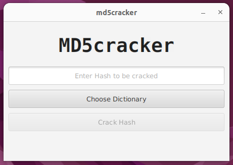
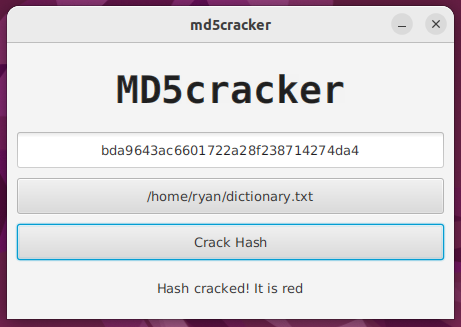
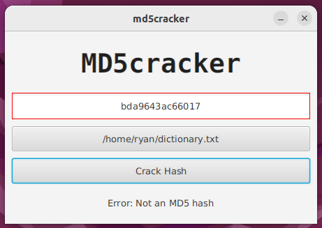
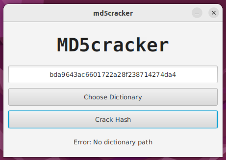

# md5cracker

A JavaFX application to find the input string used to generate an MD5 hash.

Run with `$ mvn clean javafx:run`

Packages required:

`$ sudo apt install openjdk-19-jdk openjdk-19-jre git maven`

## Features

* Uses BufferedReader class over Scanner class for better performance on larger dictionary files.
* Only hexadecimal numbers may be entered up to 32 digits in length
* Sanitized input, combination of uppercase and lowercase letters may be used (a-f, A-F)
* Visual feedback to user, TextField is highlighted red when a non-valid hash is detected
* File browser only allows .txt files and defaults to user's home directory
* Very lightly styled with CSS

## Development Environment

* Ubuntu 22.04 LTS Virtual Machine
* IntelliJ IDE

## Screenshots

### On launch

### Successful Crack

In this case the md5 hash for 'red' was found in the dictionary

### Visual User Text Validation

### Error when there is no dictionary file

## Future Consideration for Further Improvement

* Using binds to control the 'Crack Hash' button disable property when both hash and dictionary file are valid.
* Further CSS styling

## Helpful References

[OpenJFX JavaFX 19 Doc](https://openjfx.io/javadoc/19/)

[OpenJFX Introduction to FXML](https://openjfx.io/javadoc/19/javafx.fxml/javafx/fxml/doc-files/introduction_to_fxml.html)

[OpenJFX JavaFX CSS Reference](https://openjfx.io/javadoc/19/javafx.graphics/javafx/scene/doc-files/cssref.html)

[Community JavaFX Tutorial](https://fxdocs.github.io/docs/html5/)
